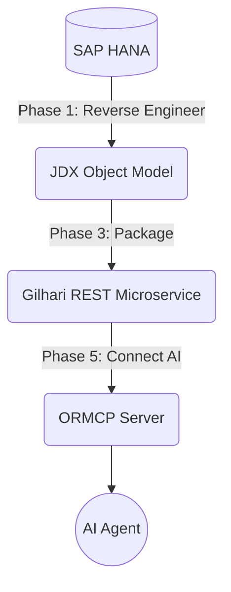

# SAP HANA ORM Skyway PoC

This project is a Proof of Concept (PoC) validating Software Tree's [ORM Skyway](https://github.com/SoftwareTree/orm_skyway_automation) pipeline against **SAP HANA Cloud**. It demonstrates full CRUD operations, relationship mapping, and AI-agent integration for SAP HANA using JDX, Gilhari, and ORMCP.

**Description**: A Proof of Concept (PoC) validating Software Tree's ORM Skyway pipeline against SAP HANA Cloud, demonstrating full CRUD operations, relationship mapping, and AI-agent integration via JDX, Gilhari, and ORMCP.

**Topics**: `sap-hana`, `orm`, `jdx`, `gilhari`, `ormcp`, `ai-agent`, `mcp`, `java`, `python`, `rest-api`

## Project Overview

**The pipeline workflow:**



This reflects the ORM Skyway automated workflow layers:
```text
ORMCP Pipeline   ─────────────────────────────────  ← AI / MCP layer
                              ↑
Gilhari Pipeline ─────────────────────────────────  ← REST microservice layer
                              ↑
JDX Pipeline     ─────────────────────────────────  ← Java/JSON ORM layer
                              ↑
SAP HANA         ═════════════════════════════════  ← foundation
```
This project successfully proves that SAP HANA (an *Experimental* database in ORM Skyway) supports:
- Full CRUD operations via REST
- Foreign-key relationships (e.g., Parent → Children collections)
- Live natural-language querying via AI agents connected through MCP.

## Project Structure

This project uses the following file structure:
```text
hana-rel/
├── .git/
├── bin/                          # Compiled Java classes
│   └── com/poc/hana/model/
├── config/                       # Driver jars and generated reverse engineering configs
│   ├── JDXDemo.config
│   ├── classnames_map.json
│   ├── ngdbc-2.29.7.jar
│   ├── reverse_eng_template.config
│   ├── reverse_eng_template.config.docker.jdx
│   ├── reverse_eng_template.config.jdx
│   └── reverse_eng_template.config.revjdx
├── gilhari/                      # Generated Gilhari configuration, Dockerfile, and curl scripts
│   ├── Dockerfile
│   ├── build.cmd / .sh
│   ├── connectORMCP.md
│   ├── curl.log
│   ├── curlWrite.log
│   ├── gilhari_service.config
│   ├── run_docker_app.cmd / .sh
│   ├── sampleCurlCommands.cmd / .sh
│   └── sampleCurlWriteCommands.cmd / .sh
├── scripts/                      # Helper scripts
│   ├── JDXDemo.bat / .sh
│   ├── JDXReverseEngineer.bat / .sh
│   ├── compile.bat / .sh
│   └── setEnvironment.bat / .sh
├── src/                          # Generated Java object model source files
│   └── com/poc/hana/model/
│       ├── Categories.java
│       ├── Products.java
│       └── Suppliers.java
├── .gitattributes                
├── .gitignore                    
├── LICENSE                       # Project license
├── README.md                     # This file
├── orm_skyway_config_hana.json   # Pipeline configuration (contains credentials, gitignored)
└── sources.txt                   # Java source files compilation list (gitignored)
```

## Prerequisites & Environment Setup

- **Java & Python**: JDK 8+ and Python 3.8+
- **Gilhari SDK**: Required for JDX ORM libraries.
- **SAP HANA JDBC Driver**: You just need to provide the path to `ngdbc-2.29.7.jar` in `orm_skyway_config_hana.json` under `"jdbc_driver_jar"`. When you run Phase 1, it will automatically be copied to the `config/` directory.
- **Docker**: For running the Gilhari REST microservice.
- **SAP HANA Cloud Instance**: IP allowlist must be configured to allow connections.

### Configuring the Project

For security and portability, database credentials and paths are configured via a JSON file. Environment variables are currently not supported in this pipeline, so please place your configuration directly in the JSON file.

1. **Pipeline Configuration (`orm_skyway_config_hana.json`)**
   Create or edit `orm_skyway_config_hana.json` in the root directory (this file is gitignored so your credentials won't be committed). You must set up the local paths for the JDX SDK and JDBC driver, and add your actual SAP HANA credentials. A standard setup looks like this:
   ```json
   {
       "jdbc_url": "jdbc:sap://<your-hana-host>:443?encrypt=true&validateCertificate=true",
       "db_schema": "<your-db-schema>",
       "db_user": "<your-db-username>",
       "db_password": "<your-db-password>",
       "jdbc_driver_jar": "/path/to/ngdbc-2.29.7.jar",
       "jdbc_driver_class": "com.sap.db.jdbc.Driver",
       "db_type": "SAPHANA",
       "jx_home": "/path/to/Gilhari-0.8.0b-SDK",
       "object_model_package": "com.poc.hana.model",
       "docker_image_name": "hana-poc-service",
       "docker_image_tag": "1.0",
       "gilhari_host_port": 80
   }
   ```
   *Note: Ensure `jdbc_driver_jar` and `jx_home` point to the correct absolute paths on your local machine. Do not use environment variables (e.g. `${JDBC_URL}`) in this file as they are currently unsupported.*

## Schema Setup

The project uses a relational test schema in the `DBADMIN` schema to test foreign-key mapping.
You can execute this SQL in your SAP HANA instance:

```sql
CREATE TABLE DBADMIN.CATEGORIES (
    ID INTEGER PRIMARY KEY, NAME NVARCHAR(100) NOT NULL, DESCRIPTION NCLOB,
    IS_ACTIVE BOOLEAN, CREATED_AT TIMESTAMP, CREATED_DATE DATE, SORT_ORDER BIGINT
);
CREATE TABLE DBADMIN.SUPPLIERS (
    ID INTEGER PRIMARY KEY, NAME NVARCHAR(100) NOT NULL, CONTACT_EMAIL NVARCHAR(150),
    IS_ACTIVE BOOLEAN, CREATED_AT TIMESTAMP, RATING DOUBLE
);
CREATE TABLE DBADMIN.PRODUCTS (
    ID INTEGER PRIMARY KEY, NAME NVARCHAR(100) NOT NULL, PRICE DECIMAL(10,2),
    IN_STOCK BOOLEAN, LAST_UPDATED TIMESTAMP, AVAILABLE_TIME TIME, WEIGHT_KG DOUBLE,
    STOCK_COUNT BIGINT, THUMBNAIL BLOB, NOTES NCLOB, CATEGORY_ID INTEGER, SUPPLIER_ID INTEGER,
    CONSTRAINT FK_PRODUCTS_CATEGORY FOREIGN KEY (CATEGORY_ID) REFERENCES DBADMIN.CATEGORIES(ID),
    CONSTRAINT FK_PRODUCTS_SUPPLIER FOREIGN KEY (SUPPLIER_ID) REFERENCES DBADMIN.SUPPLIERS(ID)
);
```

## Object Model

The object model derived from the database schema by the `orm_skyway` tool represents the relational tables as Java classes with object-oriented relationships:
- **Categories**: Represents product categories with attributes like `id`, `name`, `description`, `isActive`, etc.
- **Suppliers**: Represents product suppliers with attributes like `id`, `name`, `contactEmail`, `isActive`, and `rating`.
- **Products**: Represents individual products with attributes such as `id`, `name`, `price`, `inStock`, etc. It includes many-to-one relationships to `Categories` and `Suppliers`.

This model abstracts the underlying relational tables into a set of RESTful resources via Gilhari, allowing clients and AI agents to interact with data as JSON objects without writing SQL queries.

## Running the Pipeline

1. **Reverse Engineer & Build (Phases 1 & 3)**
   Run the ORM Skyway automation script pointing to the JSON config in this repository:
   ```bash
   python /path/to/orm_skyway_automation/orm_skyway.py -f orm_skyway_config_hana.json --phase 1+3
   ```
   *Note: If rebuilding, ensure you drop any leftover `JDXTestConnection`, `JDXMetadata`, or `JDXSequence` tables in HANA first to avoid duplicate table name errors.*

2. **Start the Microservice (Phase 4)**
   Run the generated Docker container script:
   ```bash
   # Windows
   gilhari\run_docker_app.cmd
   
   # Linux/macOS
   ./gilhari/run_docker_app.sh
   ```
   The service will be exposed on port 80.

3. **Verify REST API**
   You can verify the Gilhari REST endpoints using `curl.exe`:
   ```bash
   curl.exe -s http://localhost:80/gilhari/v1/health/check
   ```
   *To insert data, remember that POST payloads require an `entity` wrapper: `{"entity": {...}}`.*

4. **Connect AI Agent via ORMCP (Phase 5)**
   Use ORMCP to expose the REST API to Claude Desktop or Antigravity IDE. Add the following to your MCP server config:
   ```json
    "hana-ormcp": {
        "command": "ormcp-server",
        "args": [],
        "env": {
            "GILHARI_BASE_URL": "http://localhost:80/gilhari/v1/",
            "MCP_SERVER_NAME": "hana-ormcp",
            "GILHARI_NAME": "hana-poc-service",
            "GILHARI_IMAGE": "hana-poc-service:1.0",
            "GILHARI_PORT": "80",
            "READONLY_MODE": "False"
        }
    }
    ```

### Example Natural Language Queries

Once the AI Agent (like Claude) is connected to the ORMCP server, you can interact with the database using natural language. For example:
- *"Show me all products in the electronics category that are currently in stock."*
- *"Add a new supplier named 'Global Tech' with a rating of 4.5."*
- *"Update the price of the product with ID 10 to $29.99."*
- *"Which supplier provides the most products?"*

## Findings & Known Limitations

Through extensive testing, the following HANA-specific behaviors were documented:
- **Type Mapping**: Standard types (`INTEGER`, `NVARCHAR`, `DECIMAL`, `TIMESTAMP`, `DATE`, `TIME`) map cleanly.
- **NCLOB Columns**: NCLOB Columns error is fixed in JDX version 5.19 (the latest version is 5.20).
- **BLOB Columns**: Silently skipped during reverse engineering (intentional/known limitation). The reason is that JSON cannot support binary/blob values, so JDX ignores those columns.
- **Columns with Spaces**: E.g., `"DISPLAY NAME" NVARCHAR(100)` are silently skipped. This is intentional by-design behavior in JDX.
